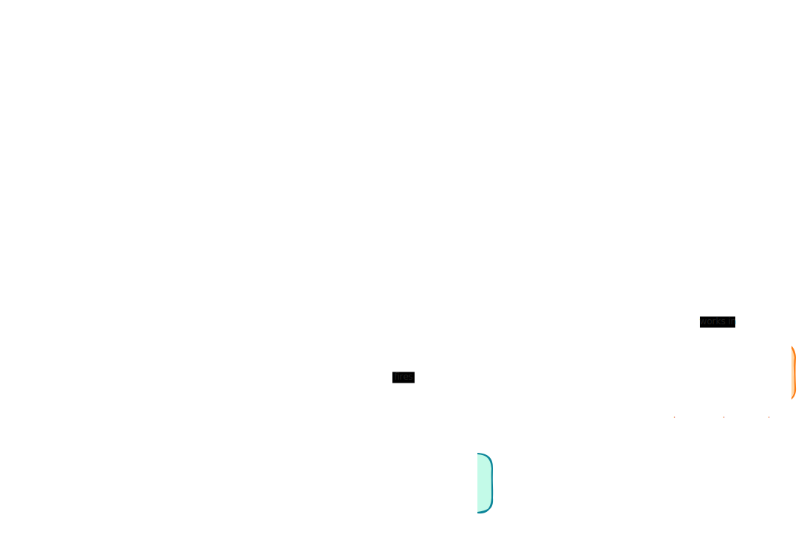

The [Architecture Overview](/concepts/architecture-overview) gives you the top-down mental model. This page is the bottom-up companion: a reference you can dip into for any single primitive once you know where it sits in the whole.

Gas City is built from **six primitives**, each with a role: **Agent** is *who* does the work, **Bead** is *what* the work is, **Formula** is *how* the work is carried out, **Rig** is *where* it happens, **Pack** is what *configures* the system, and **Event** is how you *observe* it.

They fit together as one story. **Packs** declare the agents, formulas, and orders; the local pack is your **City**, which can depend on shared packs through imports. A **Formula** is a method applied *over* work: it loops over the **Beads** of a convoy and fans each one out to an **Agent**, which executes those beads *in* a **Rig**. As all of this happens, the city fires **Events** so humans and agents can watch what's going on.



<Note>
This is reference material, not a tutorial. Each section explains what a primitive is, how it works, and shows a snippet you can copy-paste. For the guided, end-to-end path, start with the [Tutorials](/tutorials/index).
</Note>

## Agent

An **agent** is *who* does the work — a worker defined by a pack as a prompt plus a scope and a provider. When an agent is running it is a **session**; the engine backing that session is a **provider**; and a single agent can be scaled into a **pool** of identical workers sharing one queue.

You author an agent as a directory inside a pack: `agents/<name>/` holds an optional `agent.toml` plus a colocated prompt file, and the directory name *is* the agent's name and identity. A minimal agent dir contains only a prompt file and inherits everything else. Prompt discovery prefers `prompt.template.md` (with `prompt.md.tmpl` and `prompt.md` accepted for compatibility); new agents should use `prompt.template.md`.

The prompt template is the behavioral spec. The SDK contains **zero** hardcoded roles, so a "reviewer" or a "planner" is nothing more than the prompt you wrote for it. An agent's context window starts from its role prompt, rendered with deployment data — the city, the rig, the working dir, the branch, and any custom vars — and from then on its live work items and mail (all beads) flow in as it works. The agent never touches a formula directly; it only ever sees beads.

The `scope` field controls *where* the agent is instantiated: `"rig"` (one per rig — the default for pack-defined agents) or `"city"` (one per city). The `provider` field names a provider preset that backs the agent at startup; agents carry many startup and runtime fields besides — `start_command`, `args`, `prompt_mode`, `env`, `idle_timeout`, `max_session_age`, `wake_mode`, `resume_command`.

A **session** is an agent *running*. It is the surface for starting, stopping, prompting, and observing a live agent regardless of provider — covering identity, pools, sandboxes, resume, and crash adoption. Each live agent gets a stable, deterministic session name (for example `hello-world/gastown.polecat_furiosa`), so it can be messaged, woken, peeked at, and resumed across restarts. A single agent (one role) can be instantiated into many running identities — a pool of sessions — which you can list with `gc session list`.

A **provider** is the engine that backs a running agent: a named preset (`[providers.<name>]`) with a command, args, a prompt-delivery mode, a resume style, env, and capability flags like `supports_acp` and `supports_hooks`. The runtime boundary is a `Provider` interface implemented by pluggable backends — tmux, subprocess, exec, Kubernetes, plus acp/auto/hybrid routing layers. The agent selects one via its `provider` field. Examples named in the docs include Claude Code, Codex, and Gemini CLI.

A **pool** is a group of agents sharing a work queue. You create one by configuring an agent with `min_active_sessions` / `max_active_sessions` and a `scale_check` query; on each tick the controller runs `scale_check` to size the pool to demand — more pending work spawns more sessions (up to `max`), idle capacity is retired (down to `min`). A single agent's name works as a pool target too. Pool work is routed via `gc.routed_to=<pool>` metadata and discovered with a metadata query rather than by assignee.

```text
agents/
└── reviewer/
    ├── agent.toml          # provider = "claude", scope = "rig", max_active_sessions = 3
    └── prompt.template.md   # the role: what a reviewer does
```

```shell
# List the live sessions in your city
gc session list

# Peek at what an agent is currently doing
gc session peek reviewer --lines 20
```

<Tip>
`internal/agent/` is a small helper package for session naming and startup hints — not a primitive. The former "Agent Protocol" was removed in the session-first migration; an agent's lifecycle now lives in the session layer and its engine in the runtime layer.
</Tip>

## Bead

A **bead** is *what* the work is — a single unit of work with an ID, a title, a status, and a type. Beads are also the universal persistence substrate: tasks, mail, sessions, and convoys are all beads that differ only by their `type`. And beads are what agents execute.

Every bead has an **ID** (unique, prefixed with two letters derived from the city or rig name, e.g. `mc-194`), a **Title**, a **Status**, and a **Type**. Status moves through `open` → `in_progress` → `closed`: open work hasn't started and is discoverable by agents via hooks; in-progress work is claimed by an agent; closed work is done. `blocked` (has an open blocking dependency) and `deferred` (snoozed until a date) are derived states the system manages for you. Bead types name what a bead represents — `task` (a unit of work, including formula steps), `message` (inter-agent mail), `session` (a running agent), and `convoy` (a container grouping related beads).

There is no separate storage for tasks versus messages versus sessions — they are all beads with different type labels, sharing one store, one query interface, and one dependency model. That makes the bead store effectively the execution state of the entire system: every running session, in-flight message, and formula step is a bead with a status, so to know what the city is doing, you query the store. Work is persisted there, not held in memory — if an agent dies its beads stay open, and when it restarts its hooks discover the same work and pick up where it left off. If the whole city restarts, the bead store is ground truth.

Beads carry **labels** (string tags for organizing and routing, applied one at a time via `bd label add`) and arbitrary key-value **metadata** (`bd update --set-metadata`); the `gc.` prefix is the reserved namespace for engine-minted keys. Agents find work via the claim protocol: `gc hook --claim` checks existing assigned work, assigned ready work, and routed work, then atomically claims one ready bead for the session before the agent runs it — the GUPP rule, "if you find work on your hook, you run it."

**Dependencies** are blocking `needs` edges between beads: a `needs` declaration becomes a `blocks` edge, and a bead with an open `blocks` dependency is invisible to agent work queries until its blocker closes. This is how Gas City enforces ordering without a central scheduler — each bead knows what it's waiting for, and agents only ever see work that's ready. Other dependency types — `tracks` (informational), `related` (loose association), `parent-child` (containment), and `discovered-from` (work that surfaced while doing other work) — express grouping rather than ordering; only `blocks` affects work visibility.

A **convoy** is a container bead (type `convoy`) that groups related work beads as a unit, so you can track a batch — "are all five of these done yet?" Membership is recorded as `tracks` edges from the convoy to each member: grouping only, it changes no member's parent and blocks nothing, and members keep their own identity and status. You create one with `gc convoy create`, or sling auto-creates one when it wraps slung work. When a tracked member closes, Gas City checks whether the convoy now has all members closed and auto-closes it.

```shell
$ bd create "Refactor auth module" --type feature
$ bd create "Update API docs"
$ bd dep mc-a4l --blocks mc-xp7     # mc-xp7 stays invisible to agents until mc-a4l closes
$ gc convoy create "Sprint 42" mc-ykp mc-a4l mc-xp7   # groups beads via tracks edges
$ gc convoy status mc-d4g           # Progress: 1/3 closed
```

## Formula

A **formula** is *how* the work is carried out — a reusable, written-down method applied *over* work. It loops over the beads of a convoy, fanning each out to an agent, and it defines its own steps. A formula is not the work (a bead) nor a grouping of work (a convoy): applying it is what *produces* that work.

A formula is a TOML file specifying its steps, their ordering, dependencies, and control flow. Applying it is a pipeline: the `formula.toml` on disk compiles into an in-memory *recipe* — a flattened, validated list of steps plus dependency edges — which is then materialized as beads in the store. Those beads are the work, and they outlive the file and any agent session: sessions crash and restart, the work persists.

Execution responsibility splits by bead kind. The controller executes every control bead — check/retry budgets, fan-outs, tallies, drains, scope policy, finalize — and no agent participates in control execution; agents execute only the plain work (step) beads. Step beads are independently Ready-visible and routable, so different steps of one workflow can be worked by different agents, pools, or providers.

[Formulas v2](/guides/understanding-formulas#choosing-a-compiler-contract) — which a formula opts into with a single `[requires] formula_compiler = ">=2.0.0"` table — emit a flat, topologically ordered graph linked only by blocking dependency edges (from `needs`/`depends_on`), with no parent-child edges between steps. A `workflow-finalize` control step is appended depending on every sink step, and the workflow root is made to depend on it, so the root is never Ready while the workflow runs and surfaces only when the workflow completes. The step beads, not the root, are the work that wakes agents and pools. Graph-only constructs (`check`, `retry`, `drain`, `on_complete`, `tally`, reserved `gc.*` step metadata) require the v2 opt-in and fail to compile without it.

`needs` (an alias for `depends_on`) gates readiness, so a downstream step stays invisible until its dependency closes; the runtime runs whatever is ready, so work flows in dependency-ordered waves rather than on a managed schedule. Variables are declared in `[vars]` and substitute via `{{placeholder}}` into titles, descriptions, notes, assignees, and metadata, with `required` / `enum` / `pattern` enforced at instantiation. `extends` composes a child from parents: a child step whose id duplicates a parent's overrides that step in place; new child steps append.

A **run** is one execution of a formula over a convoy: applying the formula compiles the recipe and materializes it into beads, and from that moment the running work is independent of both the formula file and any agent session. A formula drives agents by *marshaling beads* to them — it loops over and orders the convoy's member beads and the step beads it defines, fanning each out to an agent that executes it. The agent never touches the formula directly, only the beads.

A formula loops *over* a convoy of work with `drain`: it scatters the input convoy into one-member units and runs an item formula per unit, fanning members out to agents and pools in parallel — the pack's single load-bearing parallelism pattern. A real build pipeline is a composed chain of formulas, written down once as `extends`-composed bases rather than living in an agent's head: decompose a plan into an implementation convoy, drain it member-by-member to implement, review the generated code, gap-analyze the implementation against the beads and fill the gaps, then check coverage before shipping.

**Sling** is the dispatch op that creates *and* routes in one motion — `gc sling <target> <name> --formula` starts a v2 workflow routed to the target. It resolves the target agent or pool, instantiates the formula, runs the agent's sling query to route each bead, optionally wraps a single bead in a tracking convoy, records telemetry, and nudges. (`gc formula cook` creates without routing.)

An **order** automates *when* a formula runs. An `order.toml` pairs a trigger (`cooldown`, `cron`, `condition`, `event`, or `manual`) with an action that is a formula name *or* an `exec` shell command — never both. When the trigger fires, the controller instantiates the formula and routes the instance to the order's pool; no human runs a verb. **Health Patrol** is one kind of order-driven controller work: on every patrol tick the controller evaluates all non-manual order triggers and fires the due ones as one phase of its tick cycle.

```toml
formula = "feature-flow"
description = "Design, implement, and review {{feature}}"

[requires]
formula_compiler = ">=2.0.0"

[vars]
feature = "the feature"

[[steps]]
id = "design"
title = "Design {{feature}}"

[[steps]]
id = "implement"
title = "Implement {{feature}}"
needs = ["design"]

[[steps]]
id = "review"
title = "Review the implementation"
needs = ["implement"]

[[steps]]
id = "submit"
title = "Submit the change"
needs = ["review"]
```

```shell
# gc formula show resolves the four steps above (needs edges intact)
# plus an appended feature-flow.workflow-finalize step — six in all
gc formula show feature-flow

# Create and route in one motion
gc sling worker feature-flow --formula
```

## Rig

A **rig** is *where* the work is done — an external project, usually a git repository, registered with the city for agents to work in. A rig gets its config — its agents, formulas, and orders — by belonging to that city. Each rig carries a **repo**, its own **bead namespace**, a **routing** context, and an **agent scope**.

A rig's directory can live anywhere on disk, inside or outside the city directory; you register one with `gc rig add <path>`, which records it by its absolute path. Each rig gets its own beads namespace and routing context, so work slung inside one rig stays logically isolated from the others. That isolation is by `issue_prefix`, not a separate database: the city and all its rigs share one underlying store — physically one Dolt server per city — and `bd` filters every read and write to the current scope's prefix.

You configure rigs under the `[[rigs]]` table. A rig declares `name` (required, unique) and `path` (the absolute filesystem path to its repository); `prefix` overrides the auto-derived bead ID prefix. `default_branch` records the repo's mainline branch so routing formulas use it as the merge target instead of probing `origin/HEAD` at sling time. `formulas_dir` is a rig-local formula directory — the highest-priority formula layer, overriding pack formulas for this rig by filename. `imports` declares named pack imports for this rig (agents from them get qualified names like `rigName/bindingName.agentName`), and `patches` applies per-agent overrides scoped to that rig. `default_sling_target` is the agent used when `gc sling` is invoked with only a bead ID; `max_active_sessions` caps total concurrent sessions across the rig; and `formula_vars` provides rig-scoped defaults for formula vars.

An agent works *in* a rig. `scope` decides whether the agent is instantiated once per city or once per rig (the default), and rig-scoped agents get stamped with the consuming rig's name during pack loading. The agent's `dir` field is that rig identity prefix — not a filesystem path — so the runtime qualified name is `dir + "/" + local`; two different rigs can each have an agent with the same local name because their qualified names differ by rig. Formulas run within a rig pick up that rig's `formula_vars` defaults, its `default_branch` as the merge target, and its `formulas_dir` as the top formula layer; a bare `gc sling` in a rig routes to its `default_sling_target`.

```toml
[[rigs]]
name = "checkout-service"
path = "../checkout-service"

[rigs.imports.review]
source = "../packs/review"
```

## Pack

A **pack** is what *configures* the system — the directory that declares agents, formulas, and orders. The local pack is your **City**, which can depend on zero or more shared packs through **imports**.

A pack is a directory containing a `pack.toml` plus zero or more definition, asset, and support files; only `pack.toml` is required, and it is the pack's metadata and manifest. A pack supplies the reusable definitions the system can load — agents, named sessions, formulas, orders, skills, commands, MCP config, providers, doctor checks, patches, globals, and pricing — plus the support files those definitions need. Definitions live in well-known directories at the pack root: `agents/<name>/`, `formulas/`, `orders/`, `skills/`, `mcp/`, `commands/`, `doctor/`, `template-fragments/`, and `overlay/`, with private files under `assets/`.

The `[pack]` identity carries `name` (a required provenance label), `schema` (required, must be `2`), and optional `version` and `requires_gc`. A pack can be used in three contexts — as the city (root) pack, as a city-level imported pack, or as a rig-level imported pack — and its scoped and unscoped definitions load into the matching surface, with rig-scoped ones stamped with the rig's name. Loading turns one or more pack directories into one flat effective `City` configuration through a deterministic, layered pipeline: imported/base pack definitions are the lower-priority layer, the parent or local pack's own definitions are the later, winning layer, and patches and defaults apply in a fixed order ending with city `[agent_defaults]` filling still-blank fields. `[[pack.requires]]` declares agents that must exist after loading; if a requirement isn't satisfied, loading fails.

A **City** is the local (root) pack: the pack rooted at the city directory, next to `city.toml`, where the city keeps its own definitions, imports, and local pack metadata. `pack.toml` defines *what* the system is; `city.toml` is the deployment manifest that declares *how this deployment runs* — rigs, the beads provider, default rig imports, city-level patches and defaults; and machine-local `.gc/` holds site bindings and runtime state. When a city has both files, new imports should be written in `pack.toml`.

**Imports** are named dependencies on shared packs, declared as `[imports.<binding>]` tables, each with a required durable `source` and an optional `version` constraint. Imports let a city reuse behavior defined elsewhere without copying files; the imported pack's definitions become available per its scope rules. The binding name is local to the importing file and is stamped on every agent the import contributes, qualifying runtime identities (for example `gastown.planner`). A city-level import belongs to the city pack's top-level `pack.toml` and loads agents into the city surface; a rig-level import appears under the `[[rigs]]` table (`[rigs.imports.<binding>]`) and stamps agents with the rig name too (for example `checkout-service/gastown.planner`). When multiple packs provide the same formula name, the importing pack wins over its imports, and a rig-level import can override city-level formulas for that rig.

```toml
# pack.toml — the local pack (a City) importing one shared pack
[pack]
name = "bright-lights"
schema = 2

[imports.gastown]
source = "https://github.com/gastownhall/gascity-packs/tree/main/gastown"
version = "^0.1"
# an imported agent becomes gastown.<name> at runtime
```

## Event

An **event** is how you *observe* what's happening. Events are fired by city activity so humans and agents can watch the system; they are the outbound notification, not something the other primitives consume. The bus is the delivery machinery underneath.

An event is a single immutable record of something that happened: a `Seq` (monotonically increasing, unique, provider-assigned — callers never set it), a `Type` (a dotted string like `bead.created`), a `Ts`, an `Actor` (who did it), a `Subject` (what was affected), a `Message`, and an optional `Payload`. Every state change — an agent started, a bead created, an order fired, the controller's own lifecycle — is recorded. The log is append-only and only grows: events are immutable once recorded, with no update or delete, and `Seq` strictly increases so observers can resume from any cursor and never miss or reorder an event.

The bus is exposed as a `Provider` interface: it embeds a write-only `Recorder` (a single `Record(Event)` method) and adds `List`, `LatestSeq`, `Watch`, and `Close` for reading. Recording is best-effort and fire-and-forget — `Record` errors are logged to stderr and never returned, so a caller's operation never fails because event recording failed. Events come in two tiers: **critical** (a bounded queue for infrastructure that must not drop anything) and **optional** (fire-and-forget, for audit). Default storage is newline-delimited JSON at `.gc/events.jsonl`, appended with `O_APPEND` for cross-process safety and resuming `Seq` across restarts by scanning for the max.

Humans observe through the `gc events` CLI (list mode writes JSON Lines; `--watch`/`--follow` stream matching envelopes live; `--seq` prints the current cursor head), through `bd show --watch`, or through the dashboard. The same surface is exposed over HTTP+SSE — city list and stream endpoints plus supervisor-wide ones that span cities. Agents, scripts, and bd hooks fire their own custom events with `gc event emit <type>` — best-effort and always exiting 0, so a bead hook never fails because of an emit.

Events are the outbound notification of every other primitive's activity. Beads fire `bead.created` / `bead.closed` / `bead.updated`; sessions fire `session.woke` / `session.stopped` / `session.crashed`; convoys fire `convoy.created` / `convoy.closed`; and order-driven formula runs fire `order.fired` / `order.completed` / `order.failed`. Orders close the loop the other way: an event-triggered order *reads* the bus to decide *when* its formula runs, querying for matching events past its cursor and firing when they exist — so the same outbound notifications that humans and agents watch also drive automation, with no specific agent role required.

```shell
# Follow new events live, filtered by type (Ctrl-C to stop)
gc events --follow --type convoy.closed

# Emit a custom event from a script or a bead hook
gc event emit task.review.requested --subject mc-42 \
  --message "needs a second look" --payload '{"priority":"high"}'
```

## Where to go next

- [Architecture Overview](/concepts/architecture-overview) — the top-down view these primitives compose into.
- [Tutorials](/tutorials/index) — the guided, end-to-end path through every primitive above.
- [Tutorial 06: Beads](/tutorials/06-beads) — go deeper on the beads that underpin everything here.
- [Understanding Formulas](/guides/understanding-formulas) — the full guide to formulas, runs, sling, and orders.
- [Understanding Packs](/guides/understanding-packs) — how packs, cities, and imports compose.
- [Reference](/reference/index) — command, config, formula, and provider lookup.
